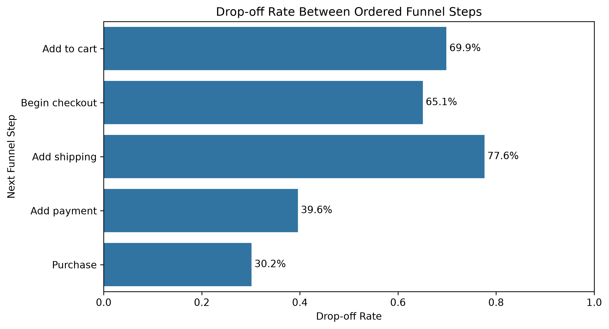

# GA4 Ecommerce Returning Customer Prediction

## Overview

This project analyzes Google Analytics 4 ecommerce event data to predict whether users active in November-December 2020 returned in January 2021. The workflow uses BigQuery SQL to build session, funnel, purchase, and customer-level feature views, then trains and evaluates machine learning models in a Jupyter notebook.

The project demonstrates SQL feature engineering, customer-level aggregation, imbalanced classification, model comparison, threshold tuning, cross-validation, feature reduction, and model interpretation.

## Tools

- BigQuery
- SQL
- Python
- pandas
- scikit-learn
- seaborn
- matplotlib
- Jupyter Notebook

## Data Source

The analysis uses the public GA4 ecommerce sample dataset available in BigQuery:

```text
bigquery-public-data.ga4_obfuscated_sample_ecommerce.events_*
```

The modeling table is built from users active between November 1 and December 31, 2020. The target variable identifies whether each user had any activity between January 1 and January 31, 2021.

## Repository Structure

```text
GA4-Ecommerce-Funnel-Analytics-ML/
├── README.md
├── requirements.txt
├── figures/
│   └── ordered_funnel_dropoff.png
├── notebook/
│   ├── funnel_plot.ipynb
│   └── returning_customer_model.ipynb
└── sql/
    ├── 01_inspect.sql
    ├── 02_user_funnel_counts_conversion.sql
    ├── 03_create_ordered_session_funnel_view.sql
    ├── 04_ordered_session_funnel_counts_conversion.sql
    ├── 05_create_stg_events_view.sql
    ├── 06_create_stg_sessions_view.sql
    ├── 07_create_fact_purchases_view.sql
    ├── 08_create_fact_items_view.sql
    ├── 09_create_mart_customer_features_view.sql
    └── 10_inspect_mart.sql
```

## SQL Workflow

The SQL files create a layered ecommerce analytics pipeline:

1. Inspect the raw GA4 event export.
2. Build user and ordered-session funnel summaries.
3. Stage event-level and session-level views.
4. Create purchase and item fact views.
5. Build a customer-level modeling mart with behavioral, recency, traffic source, device, geography, session, funnel, purchase, and revenue features.

The final modeling view is:

```text
ga4-ecommerce-portfolio-504020.ga4_ecommerce.mart_customer_features
```

## Modeling Approach

The notebook predicts `came_back_in_january`, a binary indicator for whether a user returned in January 2021.

Because only about 2.1% of users returned, the analysis treats this as an imbalanced classification problem. Model performance is evaluated with precision, recall, F1 score, ROC AUC, and especially PR AUC.

Models tested:

- Logistic regression
- Random forest
- Gradient boosting
- Reduced gradient boosting model

The workflow also includes:

- Ordered funnel drop-off visualization
- Majority-class baseline comparison
- Numeric and categorical preprocessing with `ColumnTransformer`
- One-hot encoding for categorical features
- Threshold tuning
- Cross-validation
- Correlation analysis
- Reduced feature set comparison
- Permutation importance
- Binned return-rate plots for top features

## Selected Findings

### Funnel Analysis

- The funnel analysis tracks the ecommerce path from product views through add-to-cart, checkout, shipping, payment, and purchase.
- Comparing unordered user-level funnel counts with ordered session-level funnel counts helps distinguish general engagement from sessions where users actually progressed through the expected purchase sequence.
- The largest ordered-funnel drop-off occurred between beginning checkout and adding shipping information: 77.6% of sessions that began checkout did not continue to shipping information.
- Earlier funnel stages also showed substantial drop-off: 69.9% of product-view sessions did not reach add-to-cart, and 65.1% of add-to-cart sessions did not reach checkout.
- Drop-off was lower later in checkout, with 39.6% dropping before payment and 30.2% dropping before purchase. This suggests that users who reach the payment step are comparatively more likely to complete the purchase.
- Funnel activity also supports the machine learning workflow: prior product views, checkout events, purchase events, and ordered funnel-step counts become customer-level predictors in the returning-user model.



### Returning Customer Model

- Gradient boosting produced the strongest overall ranking performance.
- The reduced gradient boosting model performed nearly identically to the full model, suggesting that many behavioral features were redundant.
- A threshold of 0.8 produced the strongest F1 score among the tested thresholds, creating a smaller and more targeted re-engagement audience.
- `days_since_last_seen` was the strongest predictor by permutation importance.
- The binned return-rate plots showed clear directional relationships for the top features:
  - `days_since_last_seen` was inversely related to January return rate. Users seen most recently before January had the highest return rate, while users whose last activity was farther in the past were much less likely to return.
  - `customer_span_days` was positively related to return behavior. Users observed across more than one day in the November-December window had a much higher January return rate than users observed on only one day.
  - `total_events` was positively related to return behavior. Users with more total events during the observation window had progressively higher January return rates, suggesting that stronger engagement intensity is associated with future re-engagement.
- The model is best interpreted as a re-engagement audience scoring tool rather than a high-confidence individual prediction model.

## Setup Instructions

### Requirements

Install Python dependencies with:

```bash
pip install -r requirements.txt
```

### BigQuery Access

The notebook queries BigQuery directly, so Google Cloud credentials and access to the project are required to rerun the data-loading step.

The SQL scripts assume the following project and dataset:

```text
ga4-ecommerce-portfolio-504020.ga4_ecommerce
```

To recreate the modeling table, run the SQL scripts in order, then open:

```text
notebook/returning_customer_model.ipynb
```

To recreate the funnel drop-off chart, open:

```text
notebook/funnel_plot.ipynb
```
